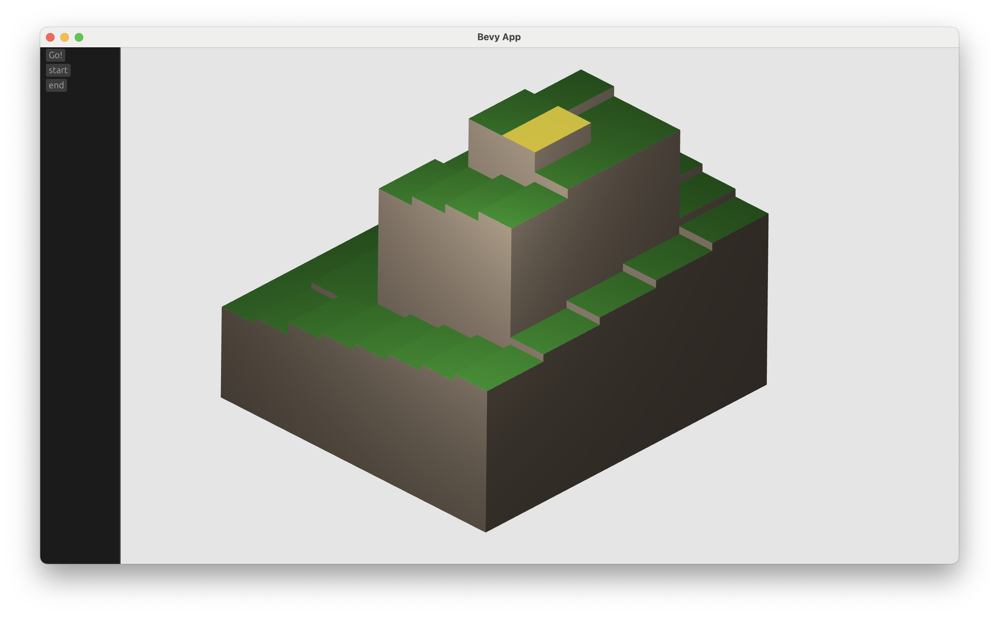
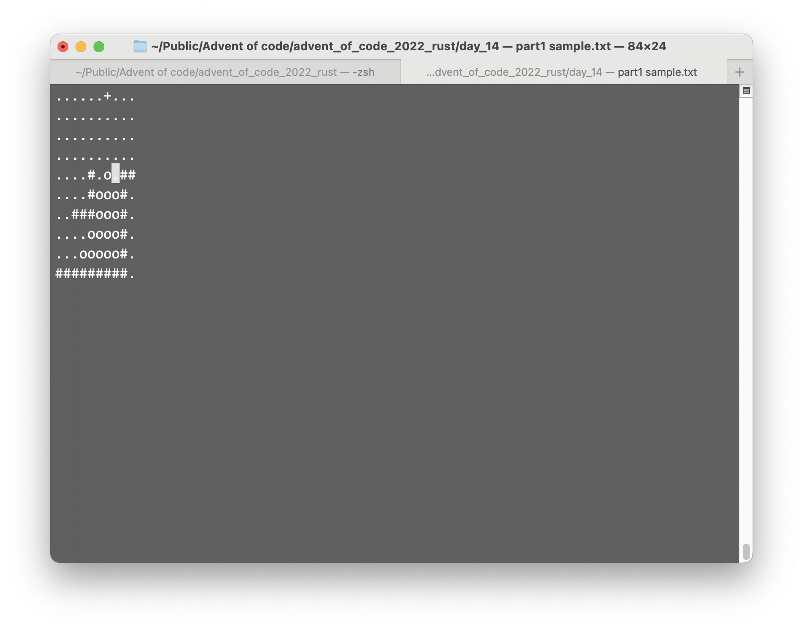
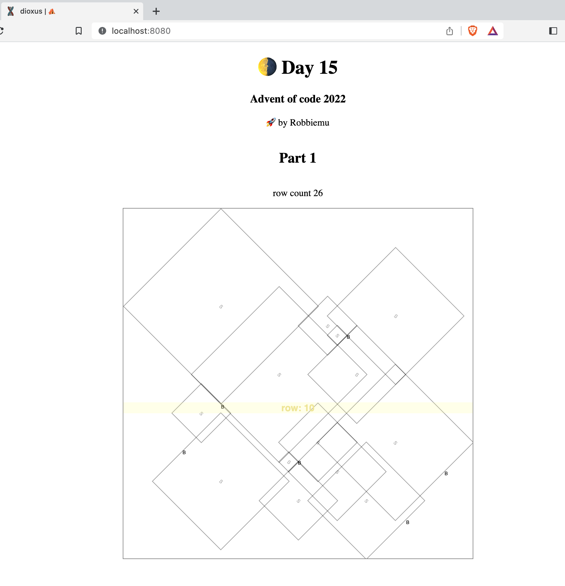

# Advent of Code 2022 to learn rust
This repo is just my code as I work through [Advent of Code](https://adventofcode.com/) in order to learn rust.

I was urged not to do this yet, to instead go back and walk through [rustlings](https://github.com/rust-lang/rustlings) and to read [the book](https://www.rust-lang.org/learn). I certainly might do that, I too often confuse `rustc` for `cargo build` and make trivial errors. Yet, I am largely up and running, and [the Primeagen](https://github.com/ThePrimeagen) recently suggested advent of code is a great way to begin to learn a new (ternary) language in [How to Learn A New Programming Language](https://youtu.be/E8cM12jRH7k). Further in the rust discord several people over the past week suggested _Advent of Code_ as a good way to learn the language. None of this means that working through _rustlings_ and taking time to read _the book_ is not worht my time, but I would like to see how far I will go before wanting to come back and find the kernels of knowledge I wish I knew earlier. :)

## Highlights

Some projects were firsts for me.

### Day 1

Day 1 was not my first project in rust. For example, there were some lightweight server admin processes I wrote last year. This year I was working on learning more rust in leet code until I switched to Advent of Code. But this is the first project that wasn't born of necessity, and also wasn't just testing things locally.

### Day 2

tiny celebration here: got to check out [lazy-static](https://github.com/rust-lang-nursery/lazy-static.rs)

### Day 5

tiny celebration: first time using [regex](https://github.com/rust-lang/regex)

### Day 6

Got to check out the awesome [Shuttle](https://www.shuttle.rs/) and publish my solver on an api! :)

### Day 7

Got to play with [petgraph](https://github.com/petgraph/petgraph). This was awesome because there were a lot of problems on leetcode that gave me some trouble because implementing graphs is not elementary in rust.

### Day 8

Since Shuttle showed me the awesomeness of [axum](https://github.com/tokio-rs/axum) (adapted for shuttle), I decided to dive in with it.

### Day 9

Publishing to google [cloud function](https://cloud.google.com/run/docs/quickstarts/build-and-deploy/deploy-service-other-languages) using [hyper](https://github.com/hyperium/hyper) service.

### Day 12

Big day for me, exploring game programming with [bevy](https://bevyengine.org/). Also got to set up [features](https://doc.rust-lang.org/cargo/reference/features.html) for the first time. Did it as an isomorphic visualization and also allowed the user to set start and end points.

### Day 14

I made a not-terrible visualization in [pancurses](https://github.com/ihalila/pancurses).

Although this task does not really need it, I built it multi-threaded, which turned into a bit of a challenge because of the underlying curses library (which has no public repository).

### Day 15

I used day 15 to try out [dioxus](https://dioxuslabs.com/). 

I have to say it was a joy and a pain at the same time. React in rust, in the browser even, sounds great, but the reality is rsx! macro leaves you with runtime borrow errors and it is a tricky thing to work through while still learning rust. The amazing debugger errors, that sometimes aren't really so amazing in the first place but more often than not are, become far more often opaque in this environment. And I totally gave up on making it a mobile app, as it did not spin up the emulator after starting a mobile project.

Despite the negatives, and the fact that javascript speed improvements keep pushing the bar, in a way that probably obviates the virtual dom approach of dioxus in the long term, its amazingly javascript-y and delivers in full on its promise of giving you a rusty experience in html composition.

Part 2 was unsolvable in reasonable time without reading at least enough in searches to find that people were talking about lines and intersections.

